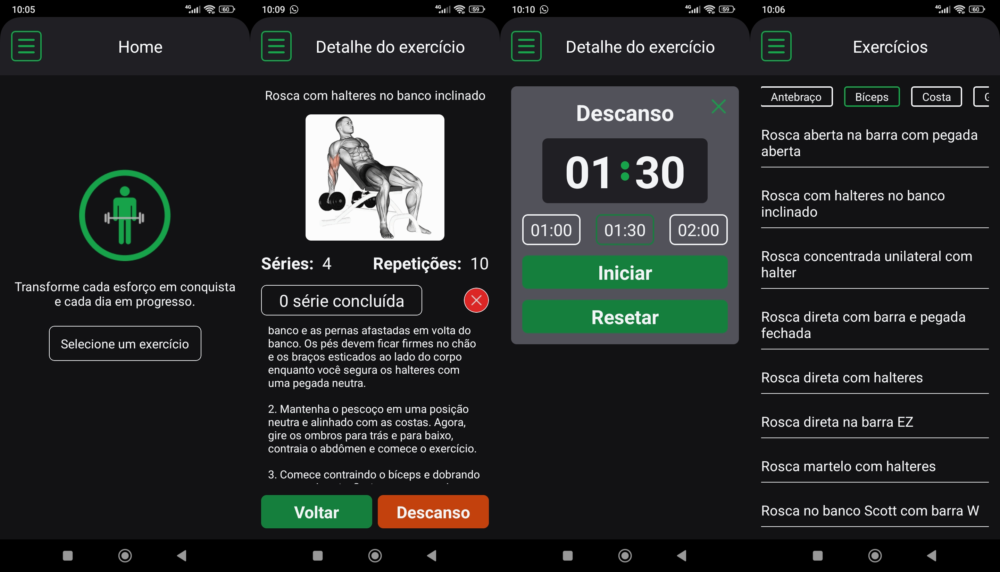

# Aplicativo de treino para academia
## Para instalar as dependências
- Precisa instalar a cli do expo: npm install -g expo-cli

- npm install

## Para iniciar o projeto
- Comando para iniciar o expo: npx expo start

- Precione a se for usar no Android Studio.

- Ou use QR Code no caso de espelhar no seu celular com o aplicativo expo go.

